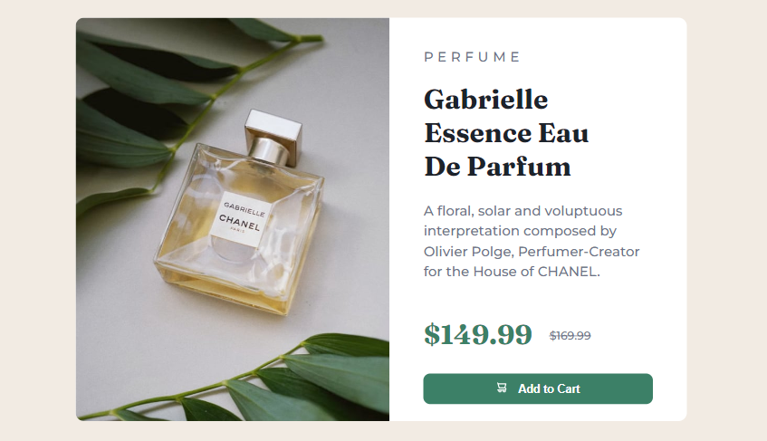

# Frontend Mentor - Product preview card component solution

This is a solution to the [Product preview card component challenge on Frontend Mentor](https://www.frontendmentor.io/challenges/product-preview-card-component-GO7UmttRfa). Frontend Mentor challenges help you improve your coding skills by building realistic projects. 

## Table of contents

- [Overview](#overview)
  - [The challenge](#the-challenge)
  - [Screenshot](#screenshot)
  - [Links](#links)
- [My process](#my-process)
  - [Built with](#built-with)
  - [What I learned](#what-i-learned)
  - [Continued development](#continued-development)
- [Author](#author)

## Overview
This project is a solution to the Product Preview Card Component challenge on Frontend Mentor. The goal of the challenge is to build a responsive product card that shows a product image, title, description, and button. The card should also have hover and focus states for interactive elements, and should be optimized for various screen sizes.

In this solution, I used HTML and CSS to build the product card, and I made the design responsive using media queries and a mobile-first approach. I also added hover and focus states using CSS pseudo-classes.

### The challenge

Users should be able to:

- View the optimal layout depending on their device's screen size
- See hover and focus states for interactive elements

### Screenshot

### Links

- Solution URL:https://scurlly.github.io/Product-preview-card/

## My process
To build this project, I started by reviewing the design brief and breaking down the layout into its component parts. I then wrote the HTML markup to create the structure of the card, and used CSS to style it. I used a mobile-first approach, starting with a narrow viewport width and progressively adding styles for larger screens.

### Built with

- Semantic HTML5 markup
- CSS custom properties
- Flexbox
- Mobile-first workflow

### What I learned

During this challenge, I had the opportunity to work on my CSS layout skills. I experimented with using flexbox to align and space the elements, and used CSS custom properties to make it easier to change the color scheme.

### Continued development

In future projects, I would like to continue exploring CSS grid and more complex CSS layout techniques.

## Author

- Frontend Mentor - [@scurlly](https://www.frontendmentor.io/profile/scurlly)

